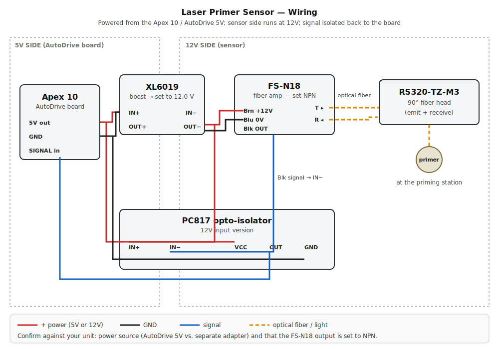
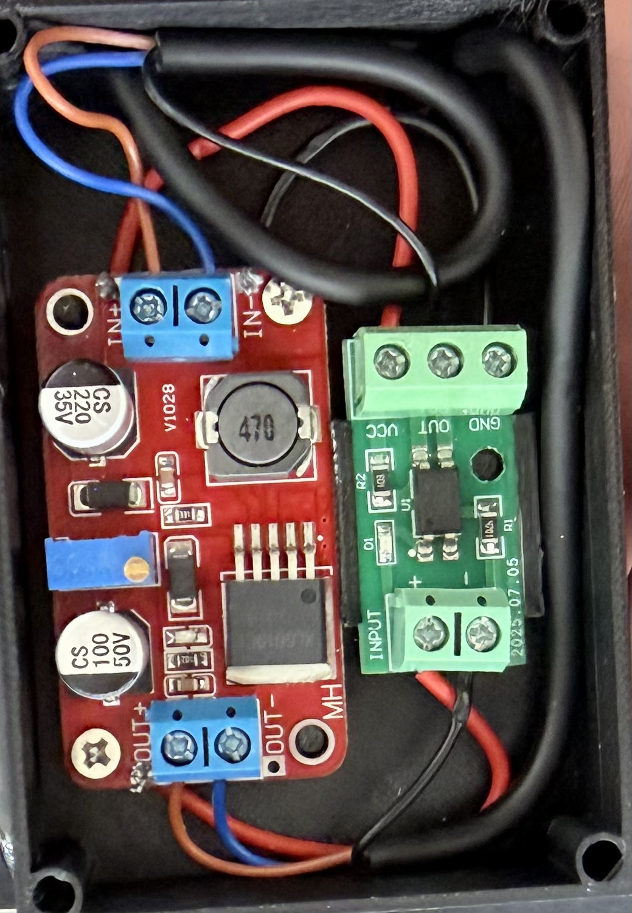
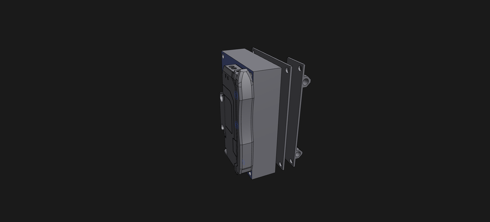
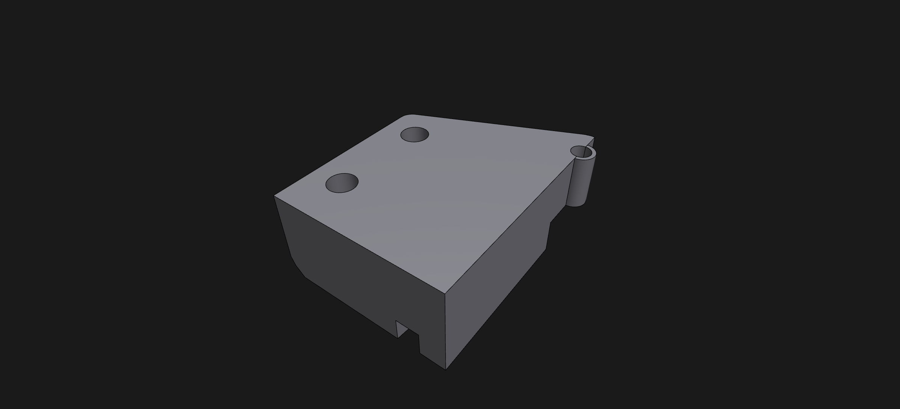
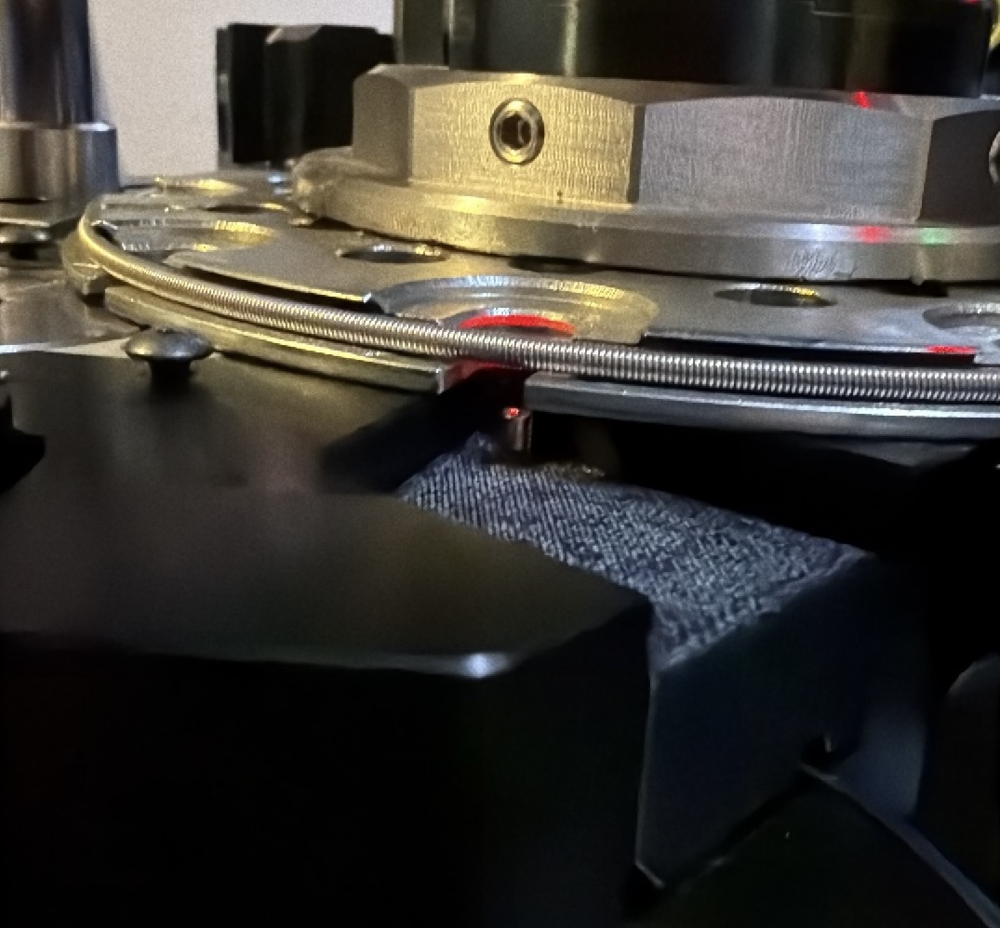
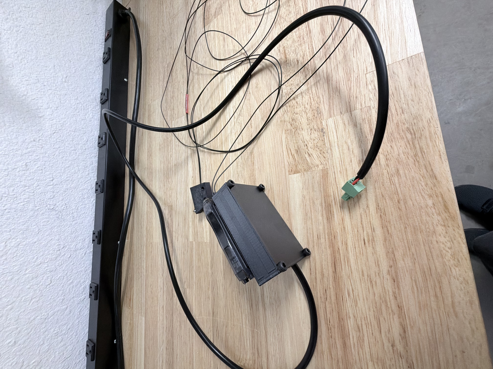

# Laser Primer Sensor

A DIY fiber-optic **primer orientation / presence sensor** for the **Mark 7 Apex 10** progressive reloading press. The sensor head watches the priming station from beneath the shell plate; if a primer is missing or sitting wrong, the amplifier flips its output and signals the press to stop before it indexes to the next station.

It's a DIY alternative to a commercial primer sensor, built from off-the-shelf parts and **two 3D-printed housings**:

- **Fiber Module Housing** — holds the RS320-TZ-M3 fiber head and mounts **under the shell plate**, aimed at the priming station.
- **In-Line Module Housing** — the electronics enclosure (amplifier, boost converter, opto-isolator). It mounts remotely — **zip-tied to the case feeder pole** or simply **set on the workbench** near the press — with the fiber and signal cable running back to the fiber head and the press.

> ⚠️ **This is a hobbyist project shared as-is, with no warranty.** A DIY sensor is a backstop, not a substitute for safe reloading practice and visual inspection. Test thoroughly with dummy/empty cases before live loading, and follow Mark 7's guidance for wiring anything into your press. You are responsible for your own machine and your own safety.

---

## How it works

The **RS320-TZ-M3** right-angle fiber head is a diffuse-reflective probe: it emits light from one fiber and reads the light bounced back into the other. A correctly seated, right-side-up primer reflects a different amount of light than an empty pocket or an upside-down/missing primer.

The **FS-N18** amplifier reads that reflected intensity as a 0–9999 value and compares it to a threshold. Run in **Dark-ON** mode with a threshold around **3950** (your tuned value), it switches its output based on whether the reflected light is above or below the set point. That output is passed through a **PC817 opto-isolator** — which galvanically isolates the sensor from the press electronics — and then into the Apex 10's sensor/stop input.

The **XL6019** boost converter takes the Apex 10 / AutoDrive board's **5 V** and steps it up to the **12 V** the FS-N18 needs. The amplifier's output is **NPN** (open-collector, switching to ground), and the **PC817 opto-isolator** bridges that 12 V signal back down to the board's 5 V SIGNAL terminal using an internal light path — so there's no direct electrical connection between the sensor side and the press electronics.

---

## Bill of materials

| # | Part | Qty | Notes |
|---|------|-----|-------|
| 1 | BOJKEON **FS-N18** dual-display fiber optic amplifier — [link](https://www.amazon.com/dp/B0DMW48CJ2) | 1 | 12–24 VDC, NPN/PNP open-collector output |
| 2 | **RS320-TZ-M3** diffuse-reflection 90° right-angle fiber head, M3 thread, 2 m lead — [link](https://www.amazon.com/dp/B0D56JZ92R) | 1 | Emit + receive fibers |
| 3 | **XL6019** 5 A adjustable DC-DC step-up (boost) module (3-pack) — [link](https://www.amazon.com/dp/B082XQC2DS) | 1 | Sets supply voltage for the amplifier |
| 4 | NOYITO **PC817** 1-channel optocoupler isolation module (12 V input version) — [link](https://www.amazon.com/dp/B0B5383L69) | 1 | Isolates the 12 V sensor signal back to the board's 5 V SIGNAL terminal |
| 5 | **In-Line Module Housing** (3D printed) | 1 | Electronics box — `hardware/In-Line_Module_Housing.step` |
| 6 | **Fiber Module Housing** (3D printed) | 1 | Holds fiber head under shell plate — `hardware/Fiber_Module_Housing.step` |
| 7 | Power | — | Taken from the **Apex 10 / AutoDrive 5 V** output (no separate adapter in the standard setup — ⚠️ confirm for your build) |
| 8 | 3-pin terminal / cable to the AutoDrive sensor port | 1 | Carries 5 V, GND, and SIGNAL between the box and the board |
| 9 | Zip ties | a few | To mount the In-Line box to the case feeder pole (optional) |

**Fasteners**
- **PCB mounting (inside housing):** standard **HDD/SSD chassis screws** (6-32 / M3-class drive screws)
- **Case plate / lid:** **M4** screws
- **Fiber head:** **M3** thread (built into the RS320-TZ-M3 head; threads into the Fiber Module Housing)

> The components are third-party products sold under their own terms. This project only covers the custom housings, wiring, and documentation.

---

## 1. Print the housings

Two parts to print, both provided as STEP files (modeled in millimeters):

- `hardware/In-Line_Module_Housing.step` — the electronics box (FS-N18, XL6019, PC817)
- `hardware/Fiber_Module_Housing.step` — the under-shell-plate mount that holds the RS320-TZ-M3 fiber head

- Import into your slicer (most slicers accept STEP directly; otherwise convert to STL).
- **Material:** PETG or ABS/ASA recommended for heat and proximity to the press; PLA works for bench testing.
- **Suggested settings:** 0.2 mm layers, 3–4 perimeters, 20–30% infill.
- Orient each part so the screw holes / mounting features and the fiber bore print cleanly; add supports only if your orientation requires them.
- Test-fit the boards, the fiber head, and the screws before final assembly; tune your slicer's hole/horizontal-expansion compensation if anything comes out tight.

---

## 2. Wiring

**Signal chain:** AutoDrive 5 V → XL6019 boost (set to 12 V) → FS-N18 amplifier → (optical fiber) RS320-TZ-M3 head → primer; FS-N18 NPN output → PC817 isolator → AutoDrive SIGNAL terminal.

**5 V side — AutoDrive board to boost and opto:**

| From | To |
|------|----|
| AutoDrive 5 V out | XL6019 IN+ |
| AutoDrive 5 V out (jumper) | PC817 VCC |
| AutoDrive GND | XL6019 IN− |
| XL6019 IN− (jumper) | PC817 GND |
| PC817 OUT | AutoDrive SIGNAL in |

**12 V side — boost out to sensor and opto input:**

| From | To |
|------|----|
| XL6019 OUT+ | FS-N18 Brown (+12 V) |
| XL6019 OUT+ (jumper) | PC817 IN+ |
| XL6019 OUT− | FS-N18 Blue (0 V) |
| FS-N18 Black (NPN signal) | PC817 IN− |
| FS-N18 T ▸ / R ◂ fiber ports | RS320-TZ-M3 emit / receive fibers |

FS-N18 cable colors: **Blue = 0 V**, **Brown = +12 V**, **Black = signal output**.

Physical reference — internal wiring of the assembled unit:

> ⚠️ **Confirm against your unit:** (1) that power comes from the **AutoDrive 5 V** terminal rather than a separate adapter, and (2) that the **FS-N18 output is the NPN version**. The rest of the wiring is determined by the parts.

3d reference — 3d render of the assembled pcb housing unit:

 

3d reference — 3d render of the fiber head housing:

Physical reference — the fiber head mounted under the shell plate, with the fiber routed back to the electronics box:

Physical reference — the assembled unit ready for mounting to the press:

---

## 3. Assembly

**Electronics — In-Line Module Housing:**
1. Set the XL6019 boost output to **12.0 V before** wiring it to anything else: feed it from the AutoDrive 5 V (power the board by USB only, nothing else connected), turn the trim pot while watching a multimeter on OUT+/OUT− until it reads 12.0 V, then disconnect power. (Getting this right first prevents most wiring headaches.)
2. Mount the XL6019 and PC817 boards inside the In-Line housing using the **HDD/SSD chassis screws** into the printed bosses.
3. Seat the FS-N18 amplifier in its pocket and route its cable to the boards per the connection table.
4. Make the wiring connections (boost → amp power, amp output → opto input, opto output → press pigtail through the 2-pin terminal).
5. Insert the RS320-TZ-M3 fibers into the FS-N18's T (transmit) and R (receive) ports, following the fiber-insertion marker and locking lever on the amplifier.
6. Close the case plate and secure with the **M4** screws.

**Fiber head — Fiber Module Housing:**
7. Fit the RS320-TZ-M3 threaded fiber head into the Fiber Module Housing so the optical face points at the primer pocket; lock the standoff with the head's nut.
8. Leave enough fiber slack to route from the under-shell-plate mount back to the electronics box.

---

## 4. Mount to the Apex 10

**Fiber Module Housing (under the shell plate):**
1. Mount it beneath the shell plate so the **RS320-TZ-M3 head aims at the priming station** — where you want to confirm primer presence/orientation.
2. Secure it so the head holds a consistent, repeatable distance and angle to the primer pocket. Consistency here is everything for reliable triggering.

**In-Line Module Housing (electronics — remote):**
3. Mount the electronics box where it's convenient and out of the way: **zip-tie it to the case feeder pole**, or just set it on the bench next to the press.
4. Route the **optical fiber** from the fiber housing back to the electronics box, and the **isolated output cable** from the box to the press's sensor/stop input.
5. Keep the fiber and cables clear of moving parts and the indexing motion, with a little slack so nothing pulls tight on a stroke.

> **Eye safety:** the fiber head emits a visible beam. Don't stare into it or aim it at eye level during setup, and verify alignment with the press unpowered where you can.

---

## 5. Configure the FS-N18

Mode and threshold (general setup): **Dark-ON**, threshold ≈ **3950**. Tune to your own optics and lighting.

**Two-point teach (recommended):**
1. With **no primer / empty pocket** in front of the head, press **SET** (hold < 2 s).
2. Place a **correctly oriented primer** at the station, press **SET** again to complete.

**Other settings to dial in:**
- **Output type:** set to **NPN** (open-collector to ground) to match the PC817 input wiring and the AutoDrive board.
- **Response time (P0–P4):** faster (P0/P1) catches the primer during the brief dwell; slower modes reject noise. Match to your press speed.
- **Output mode:** Light-ON vs Dark-ON (use Dark-ON).
- **Delay/timer:** On/Off/One-shot delay (1–9999 ms) if you need to time the read to the dwell.
- **FEC (F1–F4):** if you add a second amplifier nearby, set them to different FEC channels to prevent mutual interference.
- **Keyboard lockout:** lock the keys after tuning so settings don't drift.

---

## 6. Connect to the press

The PC817 output side ties into the Apex 10's 3-pin sensor port: **OUT → SIGNAL**, **VCC → 5 V**, **GND → GND** (the same 5 V and GND that feed the boost input). A fault — missing or misoriented primer — switches the signal so the press halts before it indexes to the next station. You can disable the sensor from the Mark 7 tablet when processing brass without primers.

---

## Troubleshooting

- **No switching / value stuck:** check the boost output voltage and FS-N18 power (Brown/Blue); confirm fibers are fully seated and the lock lever is down.
- **Triggers inconsistently:** the head standoff/angle is probably varying — tighten the mount; re-run the two-point teach; nudge the threshold.
- **False trips at speed:** try a faster response mode (P0/P1) or add a short on-delay to align the read with the dwell.
- **Press doesn't see the signal:** check PC817 output polarity and that the press input is enabled and wired for the right active level.

---

## License

This project's original work — including the custom 3D-printable housing designs, wiring diagram, photos, assembly instructions, and documentation — is licensed under the:

**Creative Commons Attribution-NonCommercial-ShareAlike 4.0 International License (CC BY-NC-SA 4.0)**

You are free to:
- **Share** — copy and redistribute the material in any medium or format
- **Adapt** — remix, transform, and build upon the material

Under the following terms:
- **Attribution** — You must give appropriate credit and indicate if changes were made.
- **NonCommercial** — You may not use the material for commercial purposes.
- **ShareAlike** — If you remix, transform, and build upon the material, you must distribute your contributions under the same license.
- **No additional restrictions** — You may not apply legal terms or technological measures that legally restrict others from doing anything the license permits.

Full license text:  
https://creativecommons.org/licenses/by-nc-sa/4.0/

### Scope of this license

This license applies only to the original project materials contained in this repository, including:
- 3D housing designs
- STEP/STL/CAD files
- Wiring diagrams
- Documentation and photos
- Original assembly instructions

Third-party hardware components, manufacturer manuals, trademarks, firmware, and product names remain the property of their respective owners and are covered by their own licenses and terms.

### Attribution notice

The original wiring diagram concept and inspiration were derived from work by **B-Team Engineering (Gross Engineering LLC)**. The wiring diagram included in this repository has been adapted and redrawn for this project, with appreciation and attribution to the original source.

### Commercial use

Commercial manufacturing, resale, kit sales, paid assembly services, or redistribution of modified versions for commercial purposes are not permitted without separate written permission from the project author.

### Commercial licensing

If you are interested in manufacturing, selling kits, offering assembled units, bundling this project into commercial products, or otherwise using this work commercially, please contact the project author to discuss licensing arrangements or collaboration opportunities.

### Disclaimer

This project is provided "as is", without warranty of any kind, express or implied. Reloading ammunition and modifying automated loading equipment can be dangerous. You are solely responsible for verifying safe operation, proper wiring, and safe reloading practices before use.

Always test thoroughly with dummy or inert components before live operation.